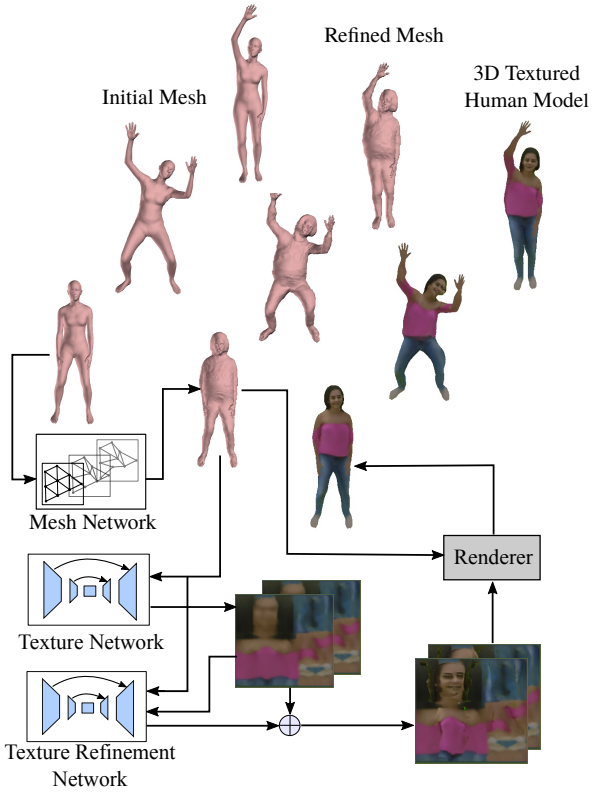
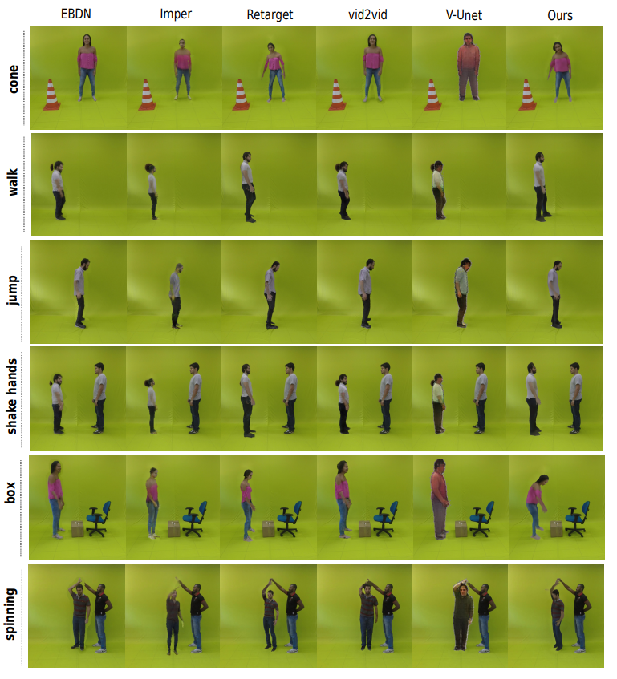
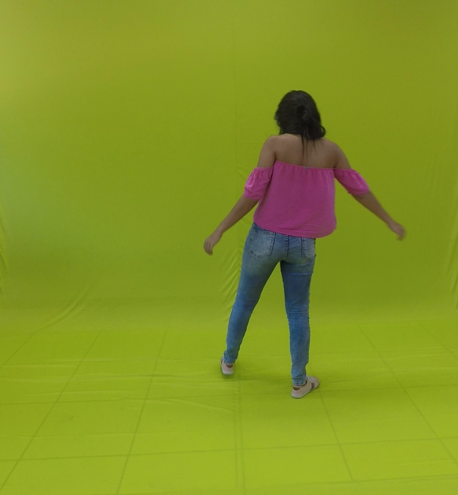
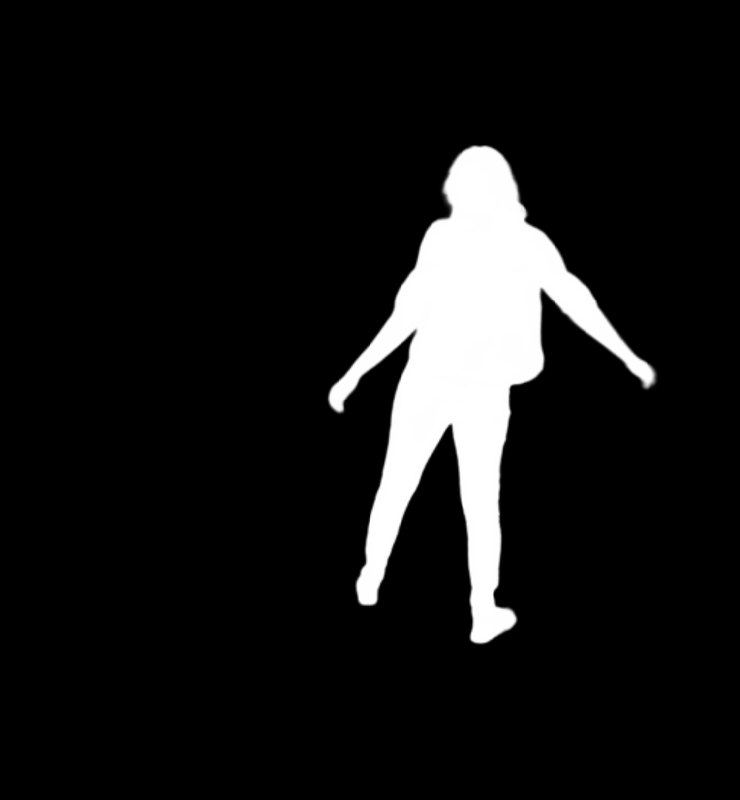
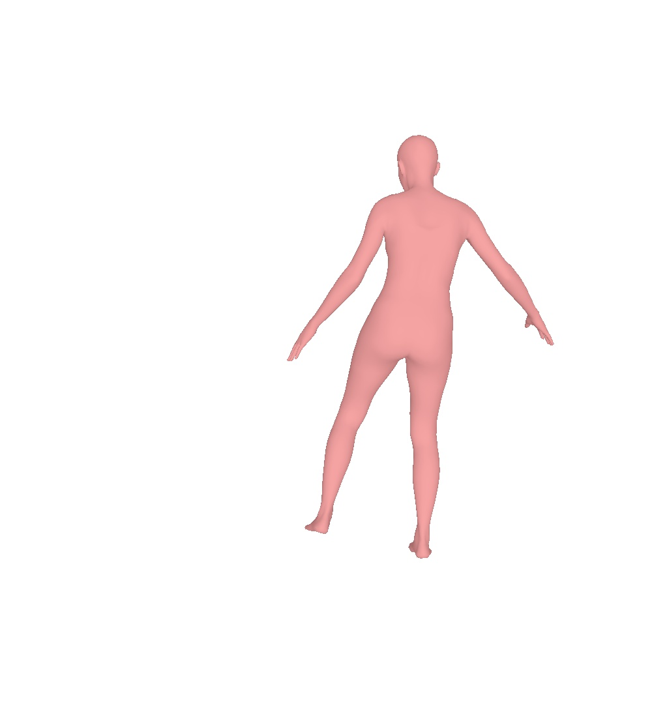
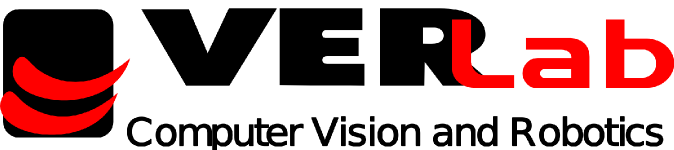

## <b> Reenacting Controllable 3D Humans with Differentiable Rendering </b> <br> [[Project Page]](https://www.verlab.dcc.ufmg.br/retargeting-motion/wacv2022) [[Paper]](https://arxiv.org/abs/2110.11746) [[Dataset]](https://github.com/verlab/ShapeAwareHumanRetargeting_IJCV_2021#human-retargeting-dataset)

<p align="center">
 &nbsp; &nbsp; &nbsp; &nbsp;  
</p>

This repository contains the PyTorch implementation of the neural rendering approach for reenacting humans **"Creating and Reenacting Controllable 3D Humans with Differentiable Rendering"** [[paper]](https://arxiv.org/abs/2110.11746).  <br>

The method leverages a carefully designed graph convolutional network (GCN) to model the human body manifold structure, jointly with differentiable rendering, to synthesize new videos of people in different contexts from where they were initially recorded.

Please cite our paper in your publications if it is helpful to your research:
```
@InProceedings{Gomes2022,
author = {Thiago L. Gomes and Thiago M. Coutinho and Rafael Azevedo and Renato Martins and Erickson R. Nascimento},
title={Creating and Reenacting Controllable 3D Humans with Differentiable Rendering},
booktitle = {IEEE/CVF Winter Conference on Applications of Computer Vision},
year = {2022}
}
```

## I - Setup and Installation

Please check the detailed instructions using conda or Singularity in [SETUP.md](setup/SETUP.md).


## II - Human Retargeting Dataset

In order to train our networks so that they learn to transfer appearance and reenact humans, we use the Human Retargeting Dataset proposed in the [paper](https://arxiv.org/abs/2103.15596): **"A Shape-Aware Retargeting Approach to Transfer Human Motion and Appearance in Monocular Videos"** [repo](https://github.com/verlab/ShapeAwareHumanRetargeting_IJCV_2021). As the train set, we use the 4-min videos from actors S0, S2, S4, S6 and reenact on the entire test set of the other actors. In our code, we reorganized the Human Retargeting Dataset as follows:

```
train
└───S1P0 (actor S0 from retargeting dataset)
│   └─── frames
│   └─── segmentations
│   └─── poses
└───S2P0 (actor S2 from retargeting dataset)
│   └─── frames
│   └─── segmentations
│   └─── poses
|   ...
└───S4P0 (actor S6 from retargeting dataset)    
|       ...
```

Inside each actor folder, we create three subfolders:

- frames: contains the frames extracted from the 4-min video provided in the Human Retargeting Dataset.
- segmentations: contains the segmentations extracted using [MODNet](https://github.com/ZHKKKe/MODNet), saved with the same pattern name as in frames folder
- poses: contains the SMPL parameters estimated using [SPIN](https://github.com/nkolot/SPIN) saved in pkl format with the same name pattern as the original images. The pickle files are structured as follows:

``` 
{
    'pose': array containing the SMPL pose parameters
        np.array<float>, shape (72,)
    'betas': array containing the SMPL betas parameters
        np.array<float>, shape (10,)
    'f': camera focal distance
        <float>
    'trans': array containing translation parameters
        np.array<float>, shape (3,)
   'img_shape': ndarray containing original image shape
        nd.array<float>, shape (W,H,3)
}
```

Example of original, segmentation and rendered SMPL images:

<p align="center">
    
    
    
</p>

For the test set, we use a similar structure but without segmentations:

```
test
└───S1P0 (actor S0 from retargeting dataset)
│   └─── box
│       └─── frames
│       └─── poses
│   └─── rotate
│   └─── ...
│   └─── fusion dance
|   ...
└───S4P0 (actor S6 from retargeting dataset)    
|       ...
```


## III - Usage

### 1. Activate the enviroment
```
singularity shell -B <bind-dir> --nv <image-name>
source activate env
```

### 2. Training

-  For train the mesh deformation in a sequence of the dataset, please run:
```
python trainMesh.py -s <subject> -p <person> -g <gender> -d <dataset_path>

```

-  Then to train texture stage, run:
```
python trainTexture.py -s <subject> -p <person> -g <gender> -d <dataset_path> -pm <mesh_network_path> --gan
```

### 3. Testing

- For testing the model reenacting, please use:
```
python test.py -pm <mesh_network_path> -pt <texture_network_path> -pr <residual_texture_network_path> -s <subject> -p <person> -g <gender> -o <output_path>

```
**VeRLab:** Laboratory of Computer Vison and Robotics https://www.verlab.dcc.ufmg.br
<br>


<br/>
